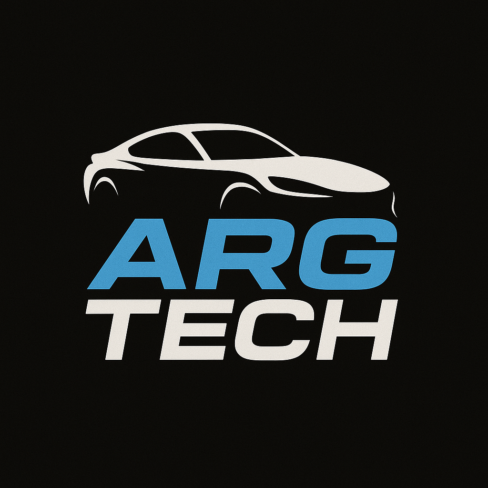
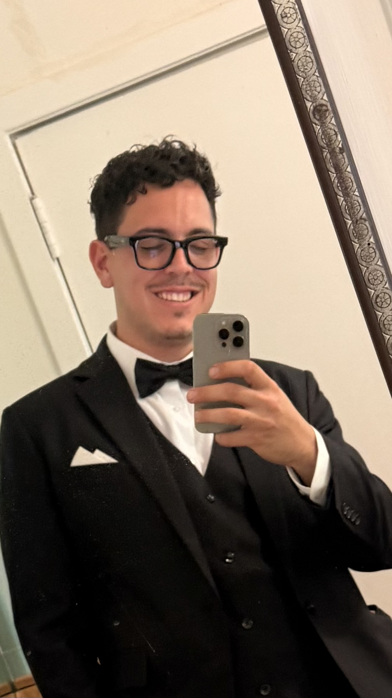

::: {.portfolio-hero}

  
  
Arg Tech | Automotive Operations | Digital Growth

  <h1>Marcos Anton</h1>
  
Business Marketing graduate candidate, entrepreneur, and Arg Tech operator building the bridge between premium automotive service, analytics, and full-scale dealership ownership.

  

    <a class="btn btn-primary" href="#expertise">View Expertise</a>
    <a class="btn btn-outline-light" href="presentation.html">Open Presentation</a>
  

:::

## From Student Marketer To Automotive Operator

::: {.columns .handshake}
::: {.column width="30%"}

{fig-alt="Professional photo of Marcos Anton"}

:::

::: {.column width="70%"}
I am a **Business Marketing graduate candidate and entrepreneur** who has run Arg Tech for the last 10 months while building a professional foundation in digital marketing and analytics.

Through Arg Tech, I manage the full operating cycle: LLC structure, client relations, complex mechanical diagnostics, repair coordination, vendor communication, digital promotion, and follow-up. My next goal is to transition that operating experience into a full-scale automotive dealership within a month of graduation.
:::
:::

Contact me at [manton@cpp.edu](mailto:manton@cpp.edu) or view my work on [GitHub](https://github.com/Manton1234).

## Expertise {#expertise}

::: {.profile-grid}
::: {.profile-panel}
### Google GA4 Certified

Measurement planning, event tracking, traffic source evaluation, and conversion reporting for digital marketing decisions.
:::

::: {.profile-panel}
### Bachelor's Degree Path

**Cal Poly Pomona**  
Business Marketing and Digital Marketing Focus  
Graduating Summer 2026
:::

::: {.profile-panel}
### A To Z Operations

LLC operations, customer intake, diagnostics, mechanical repair planning, digital promotion, client follow-through, and dealership launch planning.
:::
:::

## Highlighted Strengths

::: {.metric-grid}
::: {.metric-card}
**Audience Strategy**

Builds marketing decisions around business needs, customer relationships, search intent, and channel fit.
:::

::: {.metric-card}
**Analytics Thinking**

Connects campaign KPIs to practical next steps so performance reports explain what changed and what to do next.
:::

::: {.metric-card}
**Technical Communication**

Uses dashboards, Quarto pages, and presentation decks to make recommendations easy to inspect.
:::

::: {.metric-card}
**Entrepreneurial Execution**

Brings Arg Tech operating experience into marketing, client relations, growth systems, and automotive business planning.
:::
:::

## Selected Achievements

- Earned Google GA4, Digital Marketing, and E-commerce credentials.
- Operated Arg Tech for 10 months while managing LLC structure, client relations, diagnostics, repairs, and digital promotion.
- Managed dispatching and preventive maintenance operations for high-profile commercial accounts.
- Improved inventory systems in parts management, reducing stock outs by 20% and excess inventory by 15%.
- Created case studies for paid search optimization, SEO content strategy, email lifecycle marketing, social reporting, and GA4 measurement.

## Dealership Direction

Arg Tech is the operational proof point. The dealership plan extends that discipline into inventory, sales systems, financing readiness, customer acquisition, and digital marketing performance within a month of graduation.

## Target Audience

This portfolio is written for hiring managers, recruiters, clients, and automotive business partners evaluating Marcos Anton for digital marketing, analytics, operations, and entrepreneurship.
