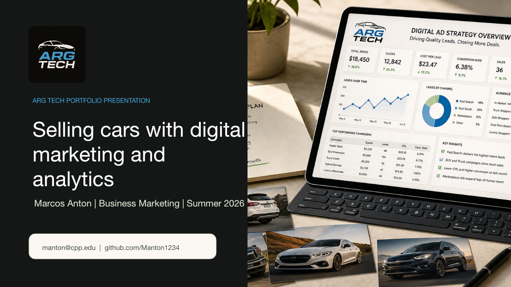

## Portfolio Focus

- Target path: automotive entrepreneur, dealership operator, marketing analyst, and digital growth strategist
- Strength: connecting Arg Tech operations with measurable automotive marketing performance
- Tools: Quarto, GitHub, GA4, dashboards, Google Ads planning, marketplace listings, and campaign reporting

::: {.notes}
Downloadable version: [Arg Tech Digital Marketing Sales PowerPoint](assets/argtech-digital-marketing-sales-presentation.pptx)
:::

{fig-alt="Preview of Marcos Anton's Arg Tech presentation title slide"}

---

## Professional Positioning

> I connect automotive operations with digital marketing decisions that are measurable, practical, and customer-focused.

The portfolio is built for professors, hiring managers, clients, and potential business partners who want evidence of campaign judgment, analytics thinking, and operational execution.

---

## Website Architecture

```{mermaid}
flowchart LR
  Home[Arg Tech Home] --> Projects[Automotive Marketing Projects]
  Projects --> Dashboard[Sales Dashboard]
  Dashboard --> Presentation[Arg Tech Presentation]
  Presentation --> Analytics[GA4 Sales Plan]
  Analytics --> Resume[Resume]
```

---

## Featured Projects

| Project | Skill Demonstrated | Employer Signal |
|---|---|---|
| Google Ads Lead Engine | CPL, leads, sales, and vehicle segment analysis | Can interpret paid media data |
| Marketplace Listing Strategy | Listing quality, pricing, photos, and lead quality | Can connect buyer trust to conversion |
| Lead Follow-Up Sequence | Buyer segmentation and appointment flow | Can plan lifecycle messaging |
| Trust Content Dashboard | Inspection and repair content performance | Can communicate performance clearly |

---

## Dashboard Approach

{fig-alt="Arg Tech automotive sales dashboard image"}

Dashboards should show what changed, why it matters, and what action should happen next.

---

## GA4 Measurement Plan

- Use consistent UTM naming for source, medium, campaign, content, and term
- Track core events such as vehicle view, marketplace click, call click, finance interest, and test-drive request
- Mark high-intent buyer actions as conversions
- Review traffic source, engagement, inventory interest, and conversion quality after launch

---

## Technical Prowess

- Website built with Quarto source files instead of a drag-and-drop builder
- Version-controlled with GitHub
- Dashboard page uses visualization logic and sample sales metrics
- Revealjs deck and downloadable PowerPoint are integrated directly into the portfolio
- SEO metadata, page titles, descriptions, and a Google Analytics measurement plan are included

---

## Next Improvement Cycle

1. Replace modeled sales metrics with verified Arg Tech results when available.
2. Add final dealership inventory photos and listing examples.
3. Render the site with Quarto and publish through GitHub Pages.
4. Create a real GA4 property after deployment, then validate tracking.
5. Use campaign data to improve Google Ads, marketplace listings, and follow-up.
